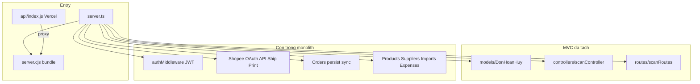

# Kế hoạch Refactor Backend MVC (Chỉ phân tích — chưa sửa code)

## Bối cảnh kỹ thuật

| Hạng mục | Chi tiết |
|---|---|
| **Nguồn sự thật** | [`server.ts`](server.ts) (~23.675 dòng, ~915 KB) |
| **Prod binary** | `esbuild` → [`dist/server.cjs`](dist/server.cjs) / [`server.cjs`](server.cjs) (`npm start`) |
| **Mẫu MVC đã có** | [`models/DonHoanHuy.js`](models/DonHoanHuy.js) → [`controllers/scanController.js`](controllers/scanController.js) → [`routes/scanRoutes.js`](routes/scanRoutes.js) |
| **DB store lõi** | [`src/db/mongoStore.ts`](src/db/mongoStore.ts) (Product, Order, ChannelListing, SyncJob, **DonHoanHuy trùng schema**) |
| **Vercel edge** | [`api/index.js`](api/index.js) + [`_lib/handlers/*`](_lib/handlers/) (proxy cPanel / fallback controller) |



**Nguyên tắc bóc tách (bám mẫu scan):** mỗi feature = `models/` (nếu cần) + `controllers/*Controller.js` + `routes/*Routes.js` → mount tường minh trong `server.ts` (`app.post/get` + `app.use`) + `authMiddleware` + tùy chọn `_lib/handlers` cho Vercel. **Không đổi contract API** trong từng bước.

---

## 1. Bản đồ tính năng còn lại

### Đã bóc tách (một phần)

- **Quét đơn / Đơn hoàn hủy (save + list):** MVC xong; vẫn mount + alias trong `server.ts` (L15821–15824, L19116–19119).
- **Chưa tách hết cùng domain:** `scan-bg-*`, `scan-bulk-update`, helpers queue disk (`normalizeScanBgKey` … `ackScanBgNotifications` ~L5692–5982), và luồng merge qua `mongoStore` (`upsertDonHoanHuy`, `mergeDonHoanHuyIntoOrders`).

### Module chính còn trong monolith

| # | Module | Route / phạm vi chính | Độ phụ thuộc | Ghi chú |
|---|---|---|---|---|
| 1 | **Auth / Session** | `/api/login`, `/api/auth/verify` | Thấp (nhưng dùng toàn app) | `authMiddleware` + JWT inline |
| 2 | **Health / Config / Debug** | `/api/health`, `/api/config/public`, `/api/debug/client-log` | Thấp | Độc lập |
| 3 | **Labels / PDF vận đơn** | `/api/public/labels`, `/labels`, `/prints` | Trung bình | Mem+disk TTL, `handlePublicLabelGet` |
| 4 | **Suppliers** | `/api/suppliers*` | Thấp | JSON/`loadSuppliers` |
| 5 | **Expenses** | `/api/expenses*` | Thấp | Độc lập |
| 6 | **Imports** | `/api/imports*` | Trung bình | Gắn product context |
| 7 | **Vietnam Address** | `/api/vietnam-address/*` | Thấp | Proxy API ngoài |
| 8 | **Settings** | `/api/settings/channels`, gemini-*, shop-connection | Trung bình | File env + channel settings |
| 9 | **AI / Gemini** | `/api/gemini/*`, `/api/ai/*` | Trung bình | `@google/genai` |
| 10 | **Products** | `/api/products*`, `/api/local-inventory`, `/api/sync-stock` | Cao | Mongo + Shopee sync queue |
| 11 | **Mapping / Auto-link** | `/api/mapping-products*`, `/api/auto-link*` | Cao | Nhiều alias path |
| 12 | **Dashboard** | `/api/dashboard` | Trung bình | Đọc orders/products store |
| 13 | **Orders CRUD / lookup / cleanup** | `/api/orders*`, `/api/sync-jobs/:jobId`, `/api/mongo/*` | Rất cao | Lõi nghiệp vụ |
| 14 | **Scan BG + Bulk** | `/api/orders/scan-bg-*`, `scan-bulk-update` | Cao | Còn sót sau MVC scan |
| 15 | **Shopee OAuth / Token** | callback, auth-url, oauth-shops, oauth/complete | Cao | Token file + refresh lock |
| 16 | **Shopee Orders Sync** | `/api/orders/pull`, `/api/shopee/orders/sync`, `/api/sync-from-shop` | Rất cao | Pull incremental + merge |
| 17 | **Shopee Warehouse / Products Sync** | `/api/shopee/products/sync*` | Cao | Listing + stock |
| 18 | **Shopee Ship / Print** | `/api/shopee/ship-order*`, `print-document*` | Rất cao | Job map, label PDF, timeout |
| 19 | **Webhooks** | `/api/webhook` (raw body HMAC) | Cao | Phải trước `express.json` |
| 20 | **Multi-channel / Publish / Publish-edit** | listing, publish, framed-images | Cao | Publish Shopee + ảnh |

**Khối helper pre-route (~L1–15695):** Labels TTL, Shopee Partner API, sync queue, warehouse, ship/print, order finance/status/persist — đây là “service layer” ẩn, chưa phải HTTP controller.

---

## 2. Danh sách hàm dùng chung — tách `utils/` / `middlewares/` TRƯỚC

Tách lớp này **trước mọi feature** để tránh đứt import khi bóc route.

### Middlewares (ưu tiên #0)

| Hàm / khối | Vị trí hiện tại | Target đề xuất |
|---|---|---|
| `authMiddleware` | `server.ts` ~L15677–15694 | [`middlewares/auth.js`](middlewares/auth.js) |
| `JWT_SECRET` + login `jwt.sign` | ~L643, L15805–15815 | `middlewares/auth.js` + `utils/jwt.js` (hoặc tái dùng [`_lib/jwtSecret.js`](_lib/jwtSecret.js)) |
| CORS origin allowlist | ~L15726–15743 | `middlewares/cors.js` |
| DB gate 503 (`mongoose.readyState`) | ~L15777–15803 | `middlewares/dbReady.js` |
| Async route wrapper (`sendStrictApiErrorJson`) | ~L15700–15723 | `middlewares/asyncHandler.js` hoặc gắn `errorHandler` |
| `errorHandler` | Đã có [`middlewares/errorHandler.js`](middlewares/errorHandler.js) | Giữ nguyên |

### Utils / services dùng chéo nhiều route

| Nhóm | Hàm điển hình | Target |
|---|---|---|
| **HTTP / lỗi** | `sendApiErrorJson`, `sendStrictApiErrorJson`, `extractHttpClientError` | `utils/apiError.js` |
| **Concurrency** | `sleep`, `delay`, `yieldEventLoop`, `runInBatches`, `mapWithConcurrency`, `withOperationTimeout`, `fetchWithTimeout` | `utils/concurrency.js` |
| **Heavy job lock** | `tryAcquireHeavyJob`, `releaseHeavyJob` | `utils/heavyJob.js` |
| **Path / env** | `resolveAppRoot`, `ensureDataDirs`, `updateEnvVar`, `maskApiKey`, `resolveAppBaseUrl` | `utils/appPaths.js`, `utils/env.js` |
| **Shopee core** | `shopeeSign`, `getValidShopeeAccessToken`, `withShopeeAccessTokenRetry`, `shopeeFetchJsonWithRetry`, `shopeePostJsonWithRetry`, token load/save | `services/shopee/` (auth, client, tokens) — **không nhét hết vào utils** |
| **Orders persist** | `loadOrders`, `saveOrders`, `loadOrdersForApi`, `persistOrdersToDatabase`, `findOrderRecord`, `resolveOrdersFromRequest` | `services/orders/` (bọc quanh `mongoStore`) |
| **Products persist** | `loadProducts`, `saveProducts`, merge/patch helpers | `services/products/` |
| **Labels** | `ensureLabelsDir`, `putLabelMem`, `getLabelMem`, `absoluteLabelUrl`, `scheduleWaybillsCleanup` | `services/labels/` |
| **Dashboard date** | `toDateKey`, `getDashboardDateRange`, `buildDashboardChart` | `utils/dashboard.js` (đã có FE [`src/utils/dashboardStats.ts`](src/utils/dashboardStats.ts) — không lẫn FE/BE) |
| **DB connect** | nested `connectDB` → `initMongo` trong `startServer` | Thống nhất với [`config/db.js`](config/db.js) / `mongoStore.initMongo` — **một cửa** |

### Rủi ro trùng SSOT cần xử lý sớm trong Phase 0

- **Hai schema `DonHoanHuy`:** [`models/DonHoanHuy.js`](models/DonHoanHuy.js) (MVC scan) **và** schema trong [`src/db/mongoStore.ts`](src/db/mongoStore.ts). Cùng collection → dễ lệch index/TTL/field khi tách tiếp scan-bg/bulk.
- **Hai DB connect style:** `config/db.js` (scan MVC) vs `initMongo` trong monolith.
- **Vercel vs cPanel:** handler `_lib` không import trực tiếp từ `server.ts`; khi tách controller phải giữ đường `dynamic import` + proxy.

---

## 3. Thứ tự bóc tách ưu tiên (Dễ → Khó / Độc lập → Phụ thuộc)

Mỗi phase: **tách file → mount lại route cũ → smoke test endpoint → mới sang phase sau**. Không rewrite business logic.

### Phase 0 — Nền tảng (bắt buộc trước)
1. `middlewares/auth.js`, `cors.js`, `dbReady.js`
2. `utils/apiError.js`, `utils/concurrency.js`, `utils/heavyJob.js`, `utils/appPaths.js`
3. Chuẩn hóa import trong `server.ts` (chỉ re-export / gọi lại — **chưa đổi hành vi**)
4. Quyết định SSOT `DonHoanHuy` + `connectDB` (một model, một connect)

### Phase 1 — Độc lập, ít side-effect
1. **Auth** (`authRoutes` + `authController`)
2. **Health / Config / Debug**
3. **Vietnam Address**
4. **Suppliers**
5. **Expenses**

### Phase 2 — CRUD vừa, phụ thuộc Mongo nhẹ
1. **Imports**
2. **Settings** (channels + gemini key)
3. **AI / Gemini**
4. **Dashboard** (đọc store — sau khi orders/products service ổn định tối thiểu)

### Phase 3 — Hoàn thiện domain Scan đã bắt đầu
1. `scan-bg-enqueue` / `status` / `ack` → `controllers/scanBgController` + `services/scanBgQueue`
2. `scan-bulk-update` → `controllers/scanBulkController`
3. Gỡ trùng mount/alias khi FE đã thống nhất path (giữ alias tạm nếu còn client cũ)
4. Hợp nhất đọc/ghi `DonHoanHuy` về một model

### Phase 4 — Catalog / Mapping
1. **Products** CRUD + local-inventory + clear-all
2. **Mapping / Auto-link** (gom alias về một router)
3. **Stock sync queue** (`enqueueShopeeStockPriceSync` …) → service riêng

### Phase 5 — Orders lõi (không gồm Shopee ship)
1. Orders list/query/lookup/patch/delete/manual
2. Cleanup / mongo TTL / hydrate-tracking / hand-over-carrier
3. Bọc `loadOrders*` / persist vào `services/orders`

### Phase 6 — Shopee platform (khó nhất)
1. **OAuth / token store** → `services/shopee/auth`
2. **HTTP client + retry** → `services/shopee/client`
3. **Orders pull / sync / diagnostics**
4. **Warehouse / products sync**
5. **Ship + Print + job maps** (labels phụ thuộc)
6. **Webhook** (giữ thứ tự middleware `raw` trước `json`)
7. **Multi-channel publish / publish-edit**

### Phase 7 — Dọn monolith
- `startServer` chỉ còn: tạo app, middleware chain, `app.use` routers, static SPA, `listen`
- Cập nhật `npm run build` esbuild nếu đổi entry/import
- Đồng bộ `_lib/handlers` trỏ controller mới khi cần fallback local

---

## 4. Cảnh báo rủi ro cao khi tách

| Rủi ro | Vì sao nguy hiểm | Cách giảm thiểu |
|---|---|---|
| **Webhook HMAC + thứ tự middleware** | `/api/webhook` phải `express.raw` **trước** `express.json`; tách router sai chỗ → chữ ký fail / 410 nhầm | Giữ mount webhook ngay đầu `startServer`; test signature với payload thật |
| **`authMiddleware` / `JWT_SECRET` lệch giữa cPanel–Vercel** | `_lib/jwtSecret.js` vs secret trong `server.ts`; login một nơi verify nơi khác | Một module secret dùng chung; test login + verify cross-origin |
| **Double `DonHoanHuy` schema** | MVC và `mongoStore` cùng collection; scan-bg/bulk vẫn dùng `mongoStore` | Phase 0 hợp nhất model trước khi tách scan-bg |
| **`scan-bulk-update` + `resolveOrderFromShopeeByScanCode`** | Handler lớn, gọi Shopee live + ghi orders + don_hoan_huy | Tách nguyên khối, không “optimize” logic trong lần đầu |
| **Heavy job lock / in-memory job maps** | Ship async, print async, scan-bg, stock queue: state trong process | Không tách thành serverless multi-instance nếu state còn RAM; giữ singleton service |
| **esbuild bundle `server.ts` → `server.cjs`** | Import path `.js` ESM, external mongoose; thiếu file → build OK nhưng runtime thiếu | Mỗi phase chạy `npm run build` + smoke `dist/server.cjs` |
| **Alias route trùng** | `/api/scan/*` vs `/api/orders/don-hoan-huy`; mapping có 3–4 path | Giữ alias đến khi FE confirm; đánh dấu deprecated |
| **DB gate 503 vs ship-order allowlist** | Một số path chạy khi DB chưa ready | Khi tách middleware, copy nguyên `allowWithoutDb` list |
| **Label PDF mem + disk TTL** | Print phụ thuộc `putLabelMem` / public URL | Tách `services/labels` trước ship/print; test URL tuyệt đối |
| **Token refresh lock Shopee** | Race refresh làm mất session shop | Giữ nguyên `refreshShopeeAccessTokenLocked` trong một service, không nhân bản |
| **Closure / biến module-level** | Queue, caches, `APP_ROOT`, token path phụ thuộc thứ tự init | Export getter khởi tạo lazy; không gọi fs lúc import nếu path chưa sẵn |
| **Vercel `_lib/handlers` proxy** | Prod Vercel không chạy monolith; chỉ proxy | Mỗi feature mới: cập nhật `LOCAL_ROUTES` hoặc chấp nhận proxy-only |

---

## 5. Cấu trúc đích (sau refactor)

```
config/db.js
middlewares/{auth,cors,dbReady,errorHandler,asyncHandler}.js
utils/{apiError,concurrency,heavyJob,appPaths,env}.js
services/shopee/{auth,client,orders,warehouse,ship,print}.js
services/{orders,products,labels,scanBgQueue}.js
models/{DonHoanHuy,Order?,Product?,...}.js   // dần thay schema trong mongoStore
controllers/*Controller.js
routes/*Routes.js
server.ts   // mỏng: compose only
```

---

## 6. Definition of Done cho từng phase

- Endpoint cũ cùng method/path/response shape
- `authMiddleware` vẫn bọc đúng route
- `npm run lint` + `npm run build` pass
- Smoke: login → verify → 1–2 API của module vừa tách
- Không đụng FE trừ khi path alias bị gỡ (có chủ đích)

---

## Đề xuất bước tiếp theo (chờ bạn duyệt)

**Bắt đầu Phase 0:** tách `authMiddleware` + CORS + DB gate + `apiError`/`concurrency`/`heavyJob` ra `middlewares/` và `utils/`, rồi mới Phase 1 (Auth + Suppliers + Expenses).

Chưa thực hiện chỉnh sửa nào cho đến khi bạn xác nhận kế hoạch / chọn phase triển khai.
